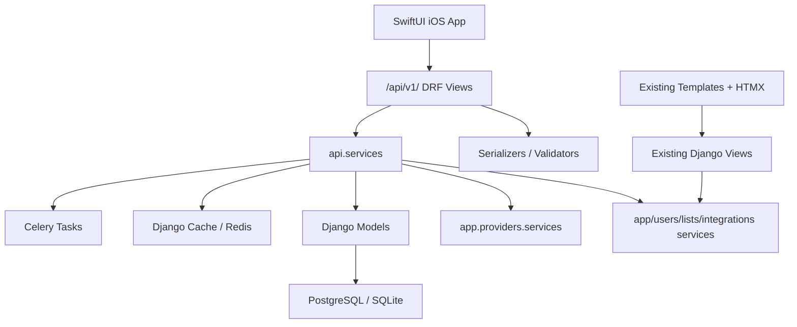

# Spine REST API v1 Implementation Plan

Status: implemented as an initial v1 API slice.

## Summary

Spine now exposes a Django REST Framework API at `/api/v1/` for native clients while preserving the existing Django template, HTMX, allauth session, Celery, import/export, and webhook routes.

The API is organized in a new `src/api/` app. Product-level social graph and feed models live in `src/social/`. Existing provider, tracking, diary, list, stats, and import code paths are reused through API service wrappers instead of replacing existing web views.

Core contracts:

- Mobile auth uses JWT access and refresh tokens.
- Media identity is the stable provider tuple: `source`, `media_type`, `media_id`, `season_number`, `episode_number`.
- Internal `Item.id` is returned only as `item_id` when a media item exists locally.
- Ratings remain 0-10 decimal values, serialized as strings.
- Dates and datetimes use ISO 8601.
- Provider keys are never exposed to clients.

## Architecture



Important files:

- `src/api/urls.py`
- `src/api/views/`
- `src/api/services/`
- `src/api/serializers/`
- `src/social/models.py`
- `src/config/settings.py`
- `src/config/urls.py`

## Endpoint Table

### Health and Meta

| Method | Path | Auth |
|---|---|---|
| GET | `/api/v1/health/` | No |
| GET | `/api/v1/meta/` | No |

### Auth and Current User

| Method | Path | Auth |
|---|---|---|
| POST | `/api/v1/auth/register/` | No |
| POST | `/api/v1/auth/login/` | No |
| POST | `/api/v1/auth/refresh/` | No |
| POST | `/api/v1/auth/logout/` | Yes |
| POST | `/api/v1/auth/password-reset/` | No |
| POST | `/api/v1/auth/password-reset/confirm/` | No |
| POST | `/api/v1/auth/apple/` | No, returns `501` placeholder |
| GET/PATCH | `/api/v1/me/` | Yes |
| POST | `/api/v1/me/avatar/` | Yes |
| PATCH | `/api/v1/me/preferences/` | Yes |

### Media

| Method | Path | Auth |
|---|---|---|
| GET | `/api/v1/media/search/` | Yes |
| GET | `/api/v1/media/discover/` | Yes, returns `501` placeholder |
| GET | `/api/v1/media/sources/` | No |
| POST | `/api/v1/media/manual/` | Yes |
| GET | `/api/v1/media/{source}/{media_type}/{media_id}/` | Optional |
| GET | `/api/v1/media/{source}/{media_type}/{media_id}/community/` | No |
| GET | `/api/v1/media/{source}/tv/{media_id}/seasons/` | Optional |
| GET | `/api/v1/media/{source}/tv/{media_id}/seasons/{season_number}/` | Optional |
| GET | `/api/v1/media/{source}/tv/{media_id}/seasons/{season_number}/episodes/` | Optional |

### Tracking

| Method | Path | Auth |
|---|---|---|
| GET | `/api/v1/tracking/` | Yes |
| GET/PUT/PATCH/DELETE | `/api/v1/tracking/{source}/{media_type}/{media_id}/` | Yes |
| POST | `/api/v1/tracking/{source}/{media_type}/{media_id}/actions/{consume,pause,resume,drop}/` | Yes |
| POST | `/api/v1/tracking/{source}/tv/{media_id}/start/` | Yes |
| POST | `/api/v1/tracking/{source}/tv/{media_id}/seasons/{season_number}/start/` | Yes |
| POST/DELETE | `/api/v1/tracking/{source}/tv/{media_id}/seasons/{season_number}/watch/` | Yes |
| POST/DELETE | `/api/v1/tracking/{source}/tv/{media_id}/seasons/{season_number}/episodes/{episode_number}/watch/` | Yes |
| POST | `/api/v1/tracking/{source}/book/{media_id}/progress/` | Yes |
| POST | `/api/v1/tracking/{source}/book/{media_id}/complete/` | Yes |

### Diary, Lists, Profiles, Social

| Method | Path | Auth |
|---|---|---|
| GET/POST | `/api/v1/diary/` | Yes |
| GET/PATCH/DELETE | `/api/v1/diary/{id}/` | Yes |
| GET | `/api/v1/diary/tags/` | Yes |
| POST/DELETE | `/api/v1/diary/{id}/like/` | Yes |
| GET/POST | `/api/v1/lists/` | Yes |
| GET/PATCH/DELETE | `/api/v1/lists/{id}/` | Yes |
| POST | `/api/v1/lists/{id}/items/` | Yes |
| DELETE | `/api/v1/lists/{id}/items/{item_id}/` | Yes |
| POST/DELETE | `/api/v1/lists/{id}/like/` | Yes |
| GET | `/api/v1/users/search/` | Yes |
| GET | `/api/v1/users/{username}/` | Optional |
| GET | `/api/v1/users/{username}/hof/` | Optional |
| GET | `/api/v1/users/{username}/activity/` | Optional |
| POST/DELETE | `/api/v1/users/{username}/follow/` | Yes |
| POST/DELETE | `/api/v1/users/{username}/block/` | Yes |
| GET | `/api/v1/feed/` | Yes |
| GET | `/api/v1/follow-requests/` | Yes |
| POST | `/api/v1/follow-requests/{id}/{accept,reject}/` | Yes |
| POST/DELETE | `/api/v1/social/likes/` | Yes |

### Stats, Imports, Export

| Method | Path | Auth |
|---|---|---|
| GET | `/api/v1/stats/me/summary/` | Yes |
| GET | `/api/v1/users/{username}/stats/summary/` | Yes |
| GET | `/api/v1/imports/` | Yes |
| POST | `/api/v1/imports/{source}/` | Yes |
| GET | `/api/v1/imports/tasks/{task_id}/` | Yes |
| DELETE | `/api/v1/imports/schedules/{schedule_id}/` | Yes |
| GET | `/api/v1/exports/csv/` | Yes |

## Auth Flow

1. iOS calls `/api/v1/auth/login/` or `/api/v1/auth/register/`.
2. Store `refresh` in Keychain.
3. Send `Authorization: Bearer <access>` on authenticated requests.
4. Refresh through `/api/v1/auth/refresh/`.
5. Logout through `/api/v1/auth/logout/`, which blacklists the refresh token.

## New Models and Migrations

- `users.User.display_name`
- `users.User.profile_private` default changed to public for new users
- `app.DiaryEntry.visibility`
- `app.DiaryEntry.contains_spoilers`
- `app.DiaryEntry.review_title`
- `app.DiaryEntry.updated_at`
- `lists.CustomList.visibility`
- `lists.CustomList.slug`
- `lists.CustomList.updated_at`
- `social.Follow`
- `social.Block`
- `social.ContentLike`
- `social.Activity`
- `social.SocialAuditLog`

Existing diary entries and lists migrate conservatively with private visibility. New diary entries default to public at the model/API layer.

## Example Payloads

### Login

```json
{
  "access": "jwt-access",
  "refresh": "jwt-refresh",
  "user": {
    "id": 1,
    "username": "armaan",
    "display_name": "armaan",
    "is_private": false
  }
}
```

### Media Search Result

```json
{
  "count": 1,
  "next": null,
  "previous": null,
  "results": [
    {
      "ref": {
        "item_id": null,
        "source": "tmdb",
        "media_type": "movie",
        "media_id": "550",
        "season_number": null,
        "episode_number": null
      },
      "title": "Fight Club",
      "subtitle": "1999",
      "image_url": "https://example.com/fight-club.jpg",
      "user_state": null
    }
  ]
}
```

## Validation

Commands run:

```bash
venv/bin/python src/manage.py check
venv/bin/python src/manage.py makemigrations --check --dry-run
venv/bin/python src/manage.py test api --verbosity 2
venv/bin/ruff check src/api src/social
```

Note: `ruff check src` still reports unrelated pre-existing lint issues outside the new API/social implementation.

## Follow-Up Work

- Harden full provider metadata normalization after iOS starts consuming real endpoints.
- Implement Sign in with Apple.
- Expand API tests for tracking, diary, lists, feed privacy, imports, and social actions.
- Decide whether old diary/list data should ever be migrated from private to public.
- Add iOS fixture JSON generated from live API responses.

Ready for implementation: YES
