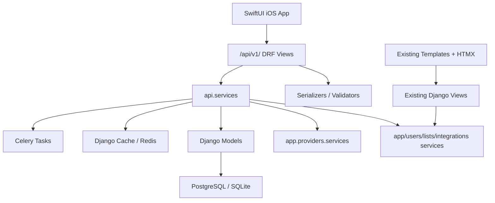

# Spine REST API v1 Implementation Plan

Status: implemented as an initial v1 API slice.

## Summary

Spine now exposes a Django REST Framework API at `/api/v1/` for native clients while preserving the existing Django template, HTMX, allauth session, Celery, import/export, and webhook routes.

The API is organized in a new `src/api/` app. Product-level social graph and feed models live in `src/social/`. Existing provider, tracking, diary, list, stats, and import code paths are reused through API service wrappers instead of replacing existing web views.

Core contracts:

- Mobile auth uses JWT access and refresh tokens.
- Media identity is the stable provider tuple: `source`, `media_type`, `media_id`, `season_number`, `episode_number`.
- Internal `Item.id` is returned only as `item_id` when a media item exists locally.
- Ratings remain 0-10 decimal values, serialized as strings.
- Dates and datetimes use ISO 8601.
- Provider keys are never exposed to clients.
- Media detail may expose typed optional `external_ratings`, `cast`, `crew`, `related_sections`, `episodes`, `seasons`, `custom_poster_url`, and `custom_backdrop_url` fields while preserving raw provider `details`, `related`, and `providers` during the transition.
- `community.rating_distribution` is Spine-only and is derived from public/followers diary ratings, never provider ratings.

## Architecture



Important files:

- `src/api/urls.py`
- `src/api/views/`
- `src/api/services/`
- `src/api/serializers/`
- `src/social/models.py`
- `src/config/settings.py`
- `src/config/urls.py`

## Endpoint Table

### Health and Meta

| Method | Path | Auth |
|---|---|---|
| GET | `/api/v1/health/` | No |
| GET | `/api/v1/meta/` | No |

### Auth and Current User

| Method | Path | Auth |
|---|---|---|
| POST | `/api/v1/auth/register/` | No |
| POST | `/api/v1/auth/login/` | No |
| POST | `/api/v1/auth/refresh/` | No |
| POST | `/api/v1/auth/logout/` | Yes |
| POST | `/api/v1/auth/password-reset/` | No |
| POST | `/api/v1/auth/password-reset/confirm/` | No |
| POST | `/api/v1/auth/apple/` | No, returns `501` placeholder |
| GET/PATCH | `/api/v1/me/` | Yes |
| POST/DELETE | `/api/v1/me/avatar/` | Yes |
| POST | `/api/v1/me/password/` | Yes |
| PATCH | `/api/v1/me/preferences/` | Yes |
| GET | `/api/v1/me/hof/` | Yes |
| PUT/DELETE | `/api/v1/me/hof/{media_type}/` | Yes |

### Media

| Method | Path | Auth |
|---|---|---|
| GET | `/api/v1/media/search/` | Yes |
| GET | `/api/v1/media/discover/` | Yes, returns `501` placeholder |
| GET | `/api/v1/media/sources/` | No |
| POST | `/api/v1/media/manual/` | Yes |
| GET | `/api/v1/media/{source}/{media_type}/{media_id}/` | Optional |
| GET | `/api/v1/media/{source}/{media_type}/{media_id}/community/` | No |
| GET | `/api/v1/media/{source}/{media_type}/{media_id}/reviews/` | Optional |
| GET | `/api/v1/media/{source}/{media_type}/{media_id}/posters/` | Yes |
| PUT | `/api/v1/media/{source}/{media_type}/{media_id}/poster/` | Yes |
| GET | `/api/v1/media/{source}/{media_type}/{media_id}/backdrops/` | Yes |
| PUT | `/api/v1/media/{source}/{media_type}/{media_id}/backdrop/` | Yes |
| GET | `/api/v1/media/{source}/tv/{media_id}/seasons/` | Optional |
| GET | `/api/v1/media/{source}/tv/{media_id}/seasons/{season_number}/` | Optional |
| GET | `/api/v1/media/{source}/tv/{media_id}/seasons/{season_number}/episodes/` | Optional |

### Tracking

| Method | Path | Auth |
|---|---|---|
| GET | `/api/v1/tracking/` | Yes |
| GET/PUT/PATCH/DELETE | `/api/v1/tracking/{source}/{media_type}/{media_id}/` | Yes |
| POST | `/api/v1/tracking/{source}/{media_type}/{media_id}/actions/{consume,pause,resume,drop}/` | Yes |
| POST | `/api/v1/tracking/{source}/tv/{media_id}/start/` | Yes |
| POST | `/api/v1/tracking/{source}/tv/{media_id}/seasons/{season_number}/start/` | Yes |
| POST/DELETE | `/api/v1/tracking/{source}/tv/{media_id}/seasons/{season_number}/watch/` | Yes |
| POST/DELETE | `/api/v1/tracking/{source}/tv/{media_id}/seasons/{season_number}/episodes/{episode_number}/watch/` | Yes |
| POST | `/api/v1/tracking/{source}/book/{media_id}/progress/` | Yes |
| POST | `/api/v1/tracking/{source}/book/{media_id}/complete/` | Yes |

`GET /api/v1/tracking/` requires `media_type` and returns the standard paged shape:
`count`, `next`, `previous`, `results`. Supported query params are `media_type`,
`status`, `ordering`/`sort`, `q`, `page`, and `page_size`. The endpoint paginates
the tracking queryset before serialization so page responses only serialize the
current page of rows.

### Diary, Lists, Profiles, Social

| Method | Path | Auth |
|---|---|---|
| GET/POST | `/api/v1/diary/` | Yes |
| GET/PATCH/DELETE | `/api/v1/diary/{id}/` | Yes |
| GET | `/api/v1/diary/tags/` | Yes |
| POST/DELETE | `/api/v1/diary/{id}/like/` | Yes |
| GET/POST | `/api/v1/lists/` | Yes |
| GET/PATCH/DELETE | `/api/v1/lists/{id}/` | Yes |
| POST | `/api/v1/lists/{id}/items/` | Yes |
| DELETE | `/api/v1/lists/{id}/items/{item_id}/` | Yes |
| POST/DELETE | `/api/v1/lists/{id}/like/` | Yes |
| GET | `/api/v1/users/search/` | Yes |
| GET | `/api/v1/users/{username}/` | Optional |
| GET | `/api/v1/users/{username}/hof/` | Optional |
| GET | `/api/v1/users/{username}/activity/` | Optional |
| POST/DELETE | `/api/v1/users/{username}/follow/` | Yes |
| POST/DELETE | `/api/v1/users/{username}/block/` | Yes |
| GET | `/api/v1/feed/` | Yes |
| GET | `/api/v1/follow-requests/` | Yes |
| POST | `/api/v1/follow-requests/{id}/{accept,reject}/` | Yes |
| POST/DELETE | `/api/v1/social/likes/` | Yes |

`GET /api/v1/diary/` supports optional `tag=<tag>` filtering and returns the same paged diary-entry response shape. Native clients use this for tag detail pages, including diary-list and poster-grid views.

### Stats, Imports, Export

| Method | Path | Auth |
|---|---|---|
| GET | `/api/v1/stats/me/summary/` | Yes |
| GET | `/api/v1/users/{username}/stats/summary/` | Yes |
| GET | `/api/v1/imports/` | Yes |
| POST | `/api/v1/imports/{source}/` | Yes |
| GET | `/api/v1/imports/tasks/{task_id}/` | Yes |
| DELETE | `/api/v1/imports/schedules/{schedule_id}/` | Yes |
| GET | `/api/v1/exports/csv/` | Yes |

## Auth Flow

1. iOS calls `/api/v1/auth/login/` or `/api/v1/auth/register/`.
2. Store `refresh` in Keychain.
3. Send `Authorization: Bearer <access>` on authenticated requests.
4. Refresh through `/api/v1/auth/refresh/`.
5. Logout through `/api/v1/auth/logout/`, which blacklists the refresh token.

## Current User Settings

`GET /api/v1/me/` returns the current `profile_payload()`, including profile fields, avatar URL, social counts, Hall of Fame map, and `preferences`.

`PATCH /api/v1/me/` accepts any subset of:

```json
{
  "username": "mika",
  "display_name": "Mika",
  "bio": "Tracking films, books, and games.",
  "pronouns": "they/them",
  "location": "Portland",
  "is_private": false
}
```

Validation matches the web account form where relevant: usernames use Django's Unicode username rules, must be unique, and demo users cannot change them. `bio` is capped at 500 characters, `pronouns` at 50, and `location` at 100. Successful updates return the full profile payload. `is_private` writes `users.User.profile_private`; visibility changes are audit-logged.

Errors use DRF field errors:

```json
{ "username": ["A user with that username already exists."] }
```

`POST /api/v1/me/avatar/` accepts multipart form-data with a required `avatar` file field. Allowed content types are `image/jpeg`, `image/png`, and `image/webp`; max size is 5 MB. Replacing an avatar deletes the previous profile picture file when possible.

```json
{ "avatar_url": "https://example.com/media/profile_pictures/avatar.png" }
```

`DELETE /api/v1/me/avatar/` clears the current profile picture, deletes the stored file when possible, and returns:

```json
{ "avatar_url": null }
```

`PATCH /api/v1/me/preferences/` accepts any subset of:

```json
{
  "enabled_media_types": ["movie", "tv", "book"],
  "date_format": "Y-m-d",
  "time_format": "H:i",
  "week_start_day": "monday",
  "quick_watch_date": "current_date",
  "release_notifications_enabled": true,
  "daily_digest_enabled": true
}
```

`enabled_media_types` must contain at least one supported `app.models.MediaTypes` value, excluding `episode`. Date, time, week-start, and quick-watch values must match the choice classes in `users.models`. Demo users cannot update preferences. Successful updates return `preferences_payload(user)`, not the full profile.

`POST /api/v1/me/password/` changes the current user's password:

```json
{
  "old_password": "current-password",
  "new_password": "new-password",
  "new_password_confirm": "new-password"
}
```

Validation uses the web password-change form, including password validators and the demo-user block. Success returns:

```json
{ "detail": "Password updated." }
```

`GET /api/v1/meta/` includes picker choices for mobile settings:

```json
{
  "date_formats": [{ "value": "Y-m-d", "label": "2026-01-18 (ISO)" }],
  "time_formats": [{ "value": "H:i", "label": "14:30 (24-hour)" }],
  "week_start_days": [{ "value": "monday", "label": "Monday" }],
  "quick_watch_dates": [{ "value": "current_date", "label": "Current Date" }]
}
```

## Current User Hall of Fame

`GET /api/v1/me/hof/` returns the current user's Hall of Fame map:

```json
{
  "items": {
    "movie": {
      "ref": {
        "item_id": 42,
        "source": "tmdb",
        "media_type": "movie",
        "media_id": "550",
        "season_number": null,
        "episode_number": null
      },
      "title": "Fight Club",
      "subtitle": null,
      "overview": null,
      "image_url": "https://example.com/fight-club.jpg",
      "poster_url": "https://example.com/fight-club.jpg",
      "backdrop_url": null,
      "poster_aspect_ratio": null,
      "poster_width": null,
      "poster_height": null,
      "poster_orientation": "unknown",
      "poster_accent_color": null,
      "release_date": null,
      "default_source": "tmdb",
      "custom_poster_url": null,
      "user_state": null
    },
    "tv": null,
    "anime": null,
    "manga": null,
    "game": null,
    "book": null,
    "comic": null
  }
}
```

`PUT /api/v1/me/hof/{media_type}/` sets one slot. Supported `media_type` values are `movie`, `tv`, `anime`, `manga`, `game`, `book`, and `comic`. The URL media type must match `ref.media_type`.

The request body uses the same media ref shape returned by `/api/v1/media/search/`; `item_id` may be `null` when the item has not been materialized locally yet:

```json
{
  "ref": {
    "item_id": null,
    "source": "tmdb",
    "media_type": "movie",
    "media_id": "550",
    "season_number": null,
    "episode_number": null
  }
}
```

`PUT` and `DELETE /api/v1/me/hof/{media_type}/` both return the updated map in the same `{"items": ...}` shape as `GET`.

## Media Reviews

`GET /api/v1/media/{source}/{media_type}/{media_id}/reviews/` returns public community diary reviews for a media identity. Query params: optional `season_number`, optional `episode_number`, and `sort=recent|popular` with `popular` as the mobile default.

Response shape is a paged list of review cards:

```json
{
  "count": 1,
  "next": null,
  "previous": null,
  "results": [
    {
      "id": 701,
      "user": { "id": 7, "username": "mika", "display_name": "Mika", "avatar_url": null },
      "rating": "9.0",
      "review_title": "A pulse under glass",
      "review": "Cold surface, hot center.",
      "contains_spoilers": false,
      "like_count": 42,
      "viewer_has_liked": false,
      "consumed_at": "2026-06-19T20:30:00Z",
      "created_at": "2026-06-20T02:11:00Z"
    }
  ]
}
```

Likes use the existing diary like endpoints: `POST /api/v1/diary/{id}/like/` and `DELETE /api/v1/diary/{id}/like/`, returning `{ "liked": true, "like_count": 43 }`.

## Media Poster Customization

Poster customization is available for authenticated users on TMDB movies and TV shows only.

`GET /api/v1/media/{source}/{media_type}/{media_id}/posters/` returns the current item poster first, followed by TMDB poster images sorted by `vote_average` and then `vote_count`, both descending:

```json
{
  "posters": [
    {
      "url": "https://image.tmdb.org/t/p/original/poster.jpg",
      "thumbnail_url": "https://image.tmdb.org/t/p/w342/poster.jpg",
      "width": 2000,
      "height": 3000,
      "aspect_ratio": 0.667,
      "vote_average": 8.0,
      "vote_count": 12,
      "language": "en",
      "is_original": false,
      "is_selected": true
    }
  ]
}
```

`PUT /api/v1/media/{source}/{media_type}/{media_id}/poster/` accepts `{ "poster_url": "https://..." }`, saves the viewer's poster preference, updates the stored item poster/accent, and returns:

```json
{
  "poster_url": "https://image.tmdb.org/t/p/original/poster.jpg",
  "custom_poster_url": "https://image.tmdb.org/t/p/original/poster.jpg",
  "poster_accent_color": "#123456"
}
```

## Media Backdrop Customization

Backdrop customization is available for authenticated users on TMDB movies and TV shows only.

`GET /api/v1/media/{source}/{media_type}/{media_id}/backdrops/` returns the default TMDB backdrop first, followed by TMDB backdrop images sorted by `vote_average` and then `vote_count`, both descending:

```json
{
  "backdrops": [
    {
      "url": "https://image.tmdb.org/t/p/original/backdrop.jpg",
      "thumbnail_url": "https://image.tmdb.org/t/p/w780/backdrop.jpg",
      "width": 1920,
      "height": 1080,
      "aspect_ratio": 1.778,
      "vote_average": 8.0,
      "vote_count": 12,
      "language": "en",
      "is_original": false,
      "is_selected": true
    }
  ]
}
```

`PUT /api/v1/media/{source}/{media_type}/{media_id}/backdrop/` accepts `{ "backdrop_url": "https://..." }`, saves the viewer's backdrop preference, does not mutate the stored item poster/accent, and returns:

```json
{
  "backdrop_url": "https://image.tmdb.org/t/p/original/backdrop.jpg",
  "custom_backdrop_url": "https://image.tmdb.org/t/p/original/backdrop.jpg"
}
```

## Media Detail

`GET /api/v1/media/{source}/{media_type}/{media_id}/` returns raw provider fields plus normalized native-client fields:

```json
{
  "ref": {
    "item_id": null,
    "source": "tmdb",
    "media_type": "movie",
    "media_id": "550",
    "season_number": null,
    "episode_number": null
  },
  "title": "Fight Club",
  "subtitle": "1999",
  "overview": "Soap, clubs, and insomnia.",
  "synopsis": "Soap, clubs, and insomnia.",
  "image_url": "https://example.com/fight-club.jpg",
  "poster_accent_color": null,
  "release_date": "1999-10-15",
  "default_source": "tmdb",
  "user_state": null,
  "backdrop_url": "https://image.tmdb.org/t/p/original/backdrop.jpg",
  "custom_backdrop_url": null,
  "custom_poster_url": null,
  "details": {
    "runtime": "2h 19m",
    "rating": "R",
    "genres": ["Drama", "Thriller"],
    "revenue": 100853753
  },
  "cast": [
    {
      "id": "819",
      "name": "Edward Norton",
      "role": null,
      "character": "Narrator",
      "image_url": "https://example.com/edward.jpg"
    }
  ],
  "crew": [
    {
      "id": "7467",
      "name": "David Fincher",
      "role": "Director",
      "character": null,
      "image_url": null
    }
  ],
  "seasons": [],
  "episodes": [],
  "providers": {
    "US": {
      "flatrate": [
        { "provider_id": 8, "provider_name": "Netflix", "logo_path": "/logo.png" }
      ]
    }
  },
  "related": {
    "recommendations": []
  },
  "related_sections": [
    {
      "id": "recommendations",
      "title": "Recommendations",
      "items": [
        {
          "ref": { "item_id": null, "source": "tmdb", "media_type": "movie", "media_id": "680", "season_number": null, "episode_number": null },
          "title": "Pulp Fiction",
          "subtitle": null,
          "overview": null,
          "image_url": "https://example.com/pulp.jpg",
          "poster_accent_color": null,
          "release_date": null,
          "default_source": "tmdb",
          "user_state": null
        }
      ]
    }
  ],
  "external_ratings": [
    { "source": "TMDB", "value": "8.4", "vote_count": 1000, "max_value": "10" },
    { "source": "IMDb", "value": "8.8", "vote_count": 2300000, "max_value": "10" },
    { "source": "Rotten Tomatoes", "value": "79%", "vote_count": 100, "max_value": "100%" }
  ],
  "community": {
    "average_rating": "8.0",
    "rating_count": 2,
    "diary_count": 3,
    "review_count": 1,
    "liked_count": 0,
    "rating_distribution": [
      { "rating": "8.0", "count": 2 }
    ]
  }
}
```

Rules:

- Books expose `other_editions` and recommendations when providers return them.
- Games expose typed sections such as `dlcs`, `expansions`, and canonical `all_related`.
- Anime and manga expose MAL/MangaUpdates related sections such as `related_anime`, `related_manga`, and recommendations.
- TV seasons are top-level `seasons`, not `related_sections`.
- Season detail exposes top-level `episodes` with `runtime` strings.
- `rating_distribution` uses only actual Spine diary ratings visible outside private scope and returns `[]` when there are no ratings.

## New Models and Migrations

- `users.User.display_name`
- `users.User.profile_private` default changed to public for new users
- `app.DiaryEntry.visibility`
- `app.DiaryEntry.contains_spoilers`
- `app.DiaryEntry.review_title`
- `app.DiaryEntry.updated_at`
- `lists.CustomList.visibility`
- `lists.CustomList.slug`
- `lists.CustomList.updated_at`
- `social.Follow`
- `social.Block`
- `social.ContentLike`
- `social.Activity`
- `social.SocialAuditLog`

Existing diary entries and lists migrate conservatively with private visibility. New diary entries default to public at the model/API layer.

## Example Payloads

### Login

```json
{
  "access": "jwt-access",
  "refresh": "jwt-refresh",
  "user": {
    "id": 1,
    "username": "armaan",
    "display_name": "armaan",
    "is_private": false
  }
}
```

### Media Search Result

```json
{
  "count": 1,
  "next": null,
  "previous": null,
  "results": [
    {
      "ref": {
        "item_id": null,
        "source": "tmdb",
        "media_type": "movie",
        "media_id": "550",
        "season_number": null,
        "episode_number": null
      },
      "title": "Fight Club",
      "subtitle": "1999",
      "image_url": "https://example.com/fight-club.jpg",
      "user_state": null
    }
  ]
}
```

## Validation

Commands run:

```bash
venv/bin/python src/manage.py check
venv/bin/python src/manage.py makemigrations --check --dry-run
venv/bin/python src/manage.py test api --verbosity 2
venv/bin/ruff check src/api src/social
```

Note: `ruff check src` still reports unrelated pre-existing lint issues outside the new API/social implementation.

## Follow-Up Work

- Harden full provider metadata normalization after iOS starts consuming real endpoints.
- Implement Sign in with Apple.
- Expand API tests for tracking, diary, lists, feed privacy, imports, and social actions.
- Decide whether old diary/list data should ever be migrated from private to public.
- Add iOS fixture JSON generated from live API responses.

Ready for implementation: YES
